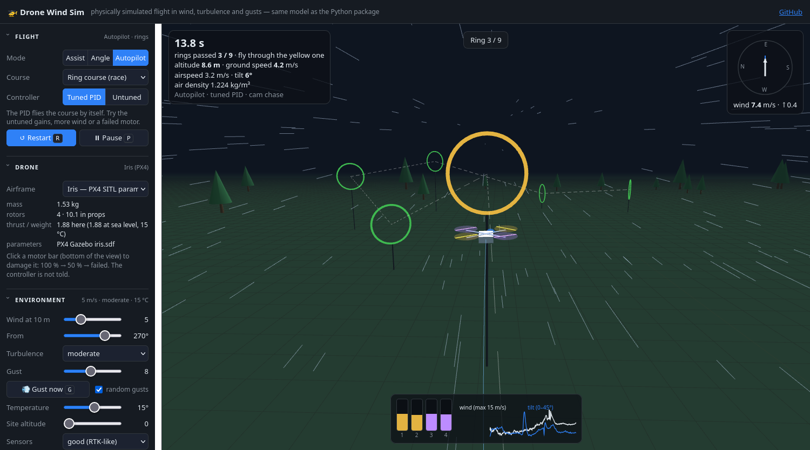
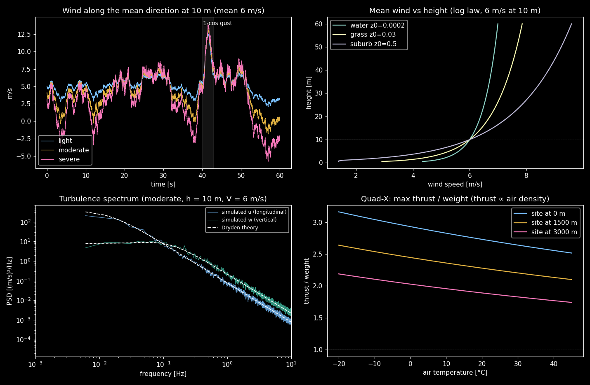
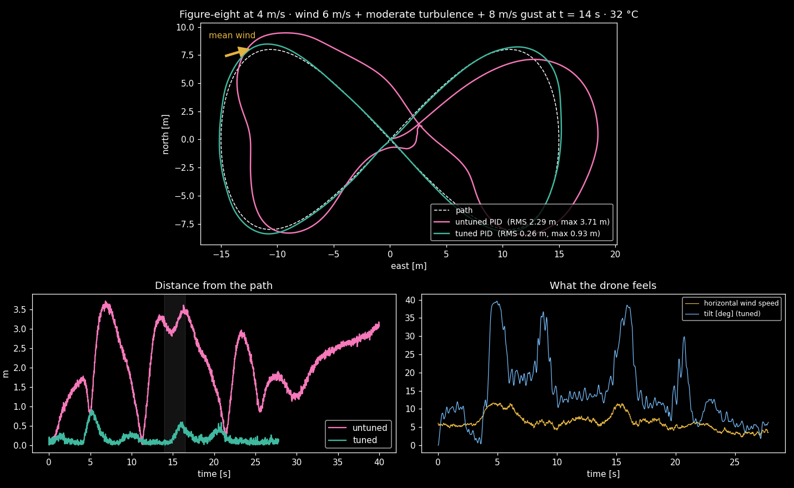
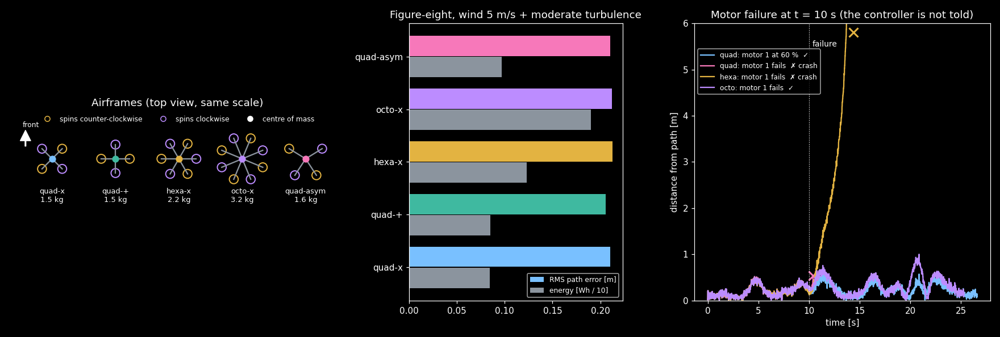
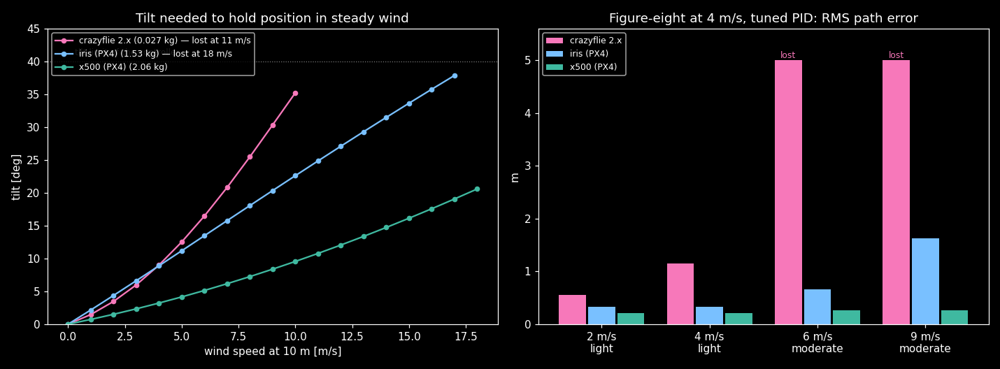

# Drone Wind Sim

**A multirotor flight simulator with a realistic outdoor environment, written from first principles in
Python, and built for developing and training adaptive flight controllers.** Wind is modelled as a log
profile plus Dryden turbulence and gusts. Temperature and altitude set the air density, which changes
the thrust. Every motor has its own model. Any rotor geometry works: quad, hexa, octo, asymmetric,
coaxial. A cascaded PID (untuned or tuned) flies paths and waypoints, and a Gymnasium-style environment
lets you train your own controllers.

### ▶ [Play it in the browser](https://writerforight.github.io/drone-wind-sim/)

Fly an Iris, an X500, a Crazyflie or a hexa/octo through a ring course in wind, turbulence and gusts. There
are three modes: *Assist* holds the drone's position like GPS mode, *Angle* leaves the wind to you, and
*Autopilot* lets the PID fly. You can set the wind, temperature and altitude, trigger a gust, or click a
motor to make it fail. The browser version is a JavaScript port of the same simulator (`web/sim.js`). On
deterministic test flights it matches the Python package to 10⁻¹³ m (`web/parity_test.js`).

[](https://writerforight.github.io/drone-wind-sim/)



## What is modelled

| Part | Model | File |
|---|---|---|
| Atmosphere | International Standard Atmosphere: temperature, pressure, density vs. height; adjustable ground temperature and site altitude | `dronesim/atmosphere.py` |
| Mean wind | log law `U(h) = U_ref ln(h/z0) / ln(h_ref/z0)`, direction, ground roughness, optional updraft | `dronesim/wind.py` |
| Turbulence | **Dryden** (MIL-F-8785C, low altitude): shaping filters on white noise, scale lengths and intensities depend on height; light / moderate / severe or any W20 | `dronesim/wind.py` |
| Gusts | discrete "1 − cos" gusts at any time, speed and direction | `dronesim/wind.py` |
| Motor + propeller | `T = C_T ρ n² D⁴`, `Q = C_Q ρ n² D⁵`, first-order speed lag (separate spin-up / spin-down time constants), speed limits, electrical power, **health** (damage / failure) | `dronesim/motor.py` |
| Airframe | generic presets + PX4 Iris, PX4 X500, Crazyflie 2.X with published parameters; rotors at arbitrary positions with spin directions and their own motor models; inertia estimate; allocation matrix built automatically | `dronesim/airframe.py` |
| Rigid body | 6-DOF, quaternions, RK4 at 500 Hz; body drag `½ρ C_dA |v_rel| v_rel` and rotor drag, both relative to the moving air; ground plane | `dronesim/dynamics.py` |
| Sensors | estimate error: GNSS-rate position/velocity noise, attitude noise, gyro noise + drifting bias (presets ideal / good / gps / poor) | `dronesim/sensors.py` |
| Control | cascaded PID (position → velocity → attitude on SO(3) → body rate), normalised by mass and inertia; mixer with yaw → roll/pitch → thrust priority on saturation | `dronesim/control/` |
| Guidance | hover, waypoints, path following with feed-forward velocity and centripetal acceleration | `dronesim/guidance.py` |
| Training env | `reset` / `step` API like Gymnasium; 4 action modes; domain randomisation of airframe, mass, motors, wind, temperature, altitude | `dronesim/env.py` |

The controller only knows the **nominal** model: standard air density, healthy motors, no payload.
Temperature, altitude, payload and motor damage are real disturbances it has to absorb, and that is the
gap an adaptive controller should close.

## Results so far

**Untuned vs. tuned PID** on a figure-eight at 4 m/s, with 6 m/s wind, moderate turbulence, an 8 m/s
gust and 32 °C. The untuned set has no integral action, so steady wind pushes it off the path:



**Five airframes, one controller, then a motor failure.** Because the loops are normalised by mass and
inertia, the same tuned PID flies all five frames. When motor 1 fails mid-flight and the controller is
not told:

- the quad survives a 40 % thrust loss, but a full failure brings it down (a quad has no spare rotor);
- the octo keeps flying;
- the hexa crashes. Physically it could fly on, but the mixer still distributes thrust as if all six
  motors worked. Adapting to this is one of the tasks for the adaptive controller.



**Your own model.** `examples/05_policy_template.py` plugs a policy into the environment and compares it
with both PIDs on the same unseen worlds. The placeholder there is a hand-written correction, not a
trained network; it already cuts the untuned PID's hover error from 2.7 m to 0.8 m. That shows a learned
model has a real signal to pick up. The tuned PID reaches 0.1 m.

## Learned control loop (draft)

A recurrent MLP flies the drone and is trained by **backpropagation through the simulator**:

```
[observation_t, memory_{t-1}]  --MLP-->  [u_t, memory_t]  ->  motors  ->  physics  ->  sensors  -> ...
```

The network never sees the wind, the payload or the air density. Its memory vector has to infer them from
the sensor stream. `dronesim/diff/` is a batched PyTorch copy of the 6-DOF physics (it matches the NumPy
version to 1e-12 m), so the distance to the target can be differentiated through motors, rigid-body
dynamics and the memory over whole flights (truncated BPTT).

- `learn/configs/default.json` holds the architecture, the loss weights (error, its 1st and 2nd derivative,
  optional regularisers), targets with a curriculum, and world randomisation. You can change any of them without
  touching code: `python -m learn.train --set model.hidden_state=64 loss.error_rate=0.1 control=motors`
- control modes: `motors` (one output per rotor, end-to-end) or `thrust_rates` (collective thrust + body rates)
- `python -m learn.evaluate runs/<name>/model.pt` flies the trained loop in the full NumPy simulator (Dryden, gusts,
  sensor model) against the tuned PID
- `python -m learn.export_web runs/<name>/model.pt --name <name>` puts it into the browser game
  (Controller → **Learned NN**). `web/learned_parity_test.js` checks that the browser flies it like Python.

Status: a first short training run (150 iterations, ~7 min on one CPU core) learns to hover and to step to
points in wind in both modes, including `motors`, where attitude control is learned from the distance loss alone.
In the game it is available for the Quad X. Longer runs and a comparison with the PID follow.

## Real drones with published parameters

Besides the generic frames (quad X/+, hexa, octo, asymmetric quad, or your own), three real drones are
available with parameters read directly from their public simulation models:

| `airframe.make(...)` | Drone | Source | Mass | Thrust/weight |
|---|---|---|---|---|
| `"iris"` | 3DR Iris, PX4's classic SITL drone | [PX4-SITL_gazebo-classic `iris.sdf`](https://github.com/PX4/PX4-SITL_gazebo-classic/tree/main/models/iris) | 1.535 kg | 1.88 |
| `"x500"` | Holybro X500, PX4's current default | [PX4-gazebo-models `x500`](https://github.com/PX4/PX4-gazebo-models/tree/main/models) | 2.06 kg | 1.69 |
| `"crazyflie"` | Bitcraze Crazyflie 2.X | [gym-pybullet-drones `cf2x.urdf`](https://github.com/utiasDSL/gym-pybullet-drones) (J. Förster, ETH 2015) | 27 g | 2.25 |

The mass, inertia, rotor positions, spin directions, thrust and torque constants, rotor speed limits,
motor time constants (spin-up faster than spin-down) and rotor drag are taken directly from these
files. Gazebo's `T = k ω²` is converted to `C_T` at ρ = 1.225 kg/m³, so a test checks that the
thrust at standard conditions is exactly the source's, while hot or thin air still reduces it. Not in
the sources, and therefore marked as estimates in `dronesim/presets_real.py`: body drag (the Gazebo
models have none), the idle speed, and the Crazyflie's motor time constant (instant in pybullet).



Size matters: the 27 g Crazyflie holds position in steady wind up to 10 m/s and loses at 11 m/s, where
it would need more than the 40° tilt limit. That is close to its nominal top speed of 30 km/h. The Iris
holds up to 17 m/s, and the heavier X500 with its lower rotor drag holds all tested speeds up to 18 m/s.
In turbulence the Crazyflie is already lost at 6 m/s mean wind, because its gusts reach 12 m/s.

## Quick start

```bash
pip install numpy scipy matplotlib        # + torch for learn/ (the learned control loop)
python tests/test_physics.py              # physics checks
python examples/01_environment.py         # -> docs/environment.png
python examples/02_pid_untuned_vs_tuned.py
python examples/03_geometries_and_motor_failure.py
python examples/04_custom_airframe_and_controller.py
python examples/05_policy_template.py     # plug in your own model
python examples/06_real_drones.py         # -> docs/real_drones.png
python examples/07_train_loop.py          # train the learned loop (~5 min) and compare it with the PID
```

```python
from dronesim import *

af  = airframe.make("iris")                                 # or hexa_x(), crazyflie, x500, your own (example 04)
sim = Simulation(af,
                 Atmosphere(temperature_c=30, ground_altitude=800),
                 WindField(mean_speed=6, direction_deg=270, turbulence="moderate",
                           gusts=[Gust(t0=10, duration=2, speed=8, from_deg=180)]),
                 SensorModel.preset("gps"))
sim.reset(position=(0, 0, 10))
log = sim.run(CascadedPID(af, "tuned"), PathFollower(figure_eight(), speed=4), duration=40)
print(metrics(log))      # RMS / max path error, energy, motor saturation, max tilt, crash
```

### Training environment

```python
env = DroneEnv(control="residual", task="path", airframes=["quad_x", "hexa_x"],
               wind_speed=(0, 9), temperature_c=(-5, 38), weak_motor_prob=0.3, motor_health=(0.6, 1.0))
obs, info = env.reset(seed=0)
obs, reward, terminated, truncated, info = env.step(env.action_space.sample())
```

| `control=` | action | idea |
|---|---|---|
| `"pid"` | none | baseline |
| `"residual"` | 3 numbers → extra acceleration | PID keeps it stable; the model learns the disturbance (Neural-Fly-style) |
| `"thrust_rates"` | collective thrust + 3 body rates | the usual RL setup for drones |
| `"motors"` | one thrust per rotor | end-to-end |

The observation does not include the wind, air density or motor health. Those values are in `info`
for analysis, so a policy has to infer them from how the drone moves. `dronesim.env.make_gymnasium()`
wraps the environment as a real `gymnasium.Env` if Gymnasium is installed (for Stable-Baselines3 etc.).

## Tests

`tests/test_physics.py` checks each model against known results:

- ISA values from the standard tables;
- the Dryden turbulence variance and correlation time match the model's σ and L/V (averaged over seeds);
- the allocation matrix has full rank for all presets, and the hover thrust splits exactly to m·g;
- the real-drone presets reproduce the thrust and torque of their source files exactly;
- free fall is −g, and the drone holds hover with constant rotor speeds;
- torque-free rotation conserves energy and angular momentum;
- thrust scales with air density, and the wind pushes the drone downwind;
- the tuned PID holds position in wind on every airframe while the untuned one drifts;
- all four environment modes run.

`web/parity_test.js` runs the browser port and the Python simulator on the same six flights and checks that
the trajectories match:

```bash
python web/parity_ref.py > /tmp/ref.json && node web/parity_test.js /tmp/ref.json
```

## Roadmap

1. ~~Environment: atmosphere, wind, turbulence, gusts, sensors~~
2. ~~Airframes, motors, 6-DOF dynamics~~
3. ~~Cascaded PID (untuned / tuned)~~; automatic tuning by optimisation over wind scenarios
4. ~~Waypoints and path following~~; minimum-snap trajectories
5. Adaptive control: INDI, a learned wind model with online adaptation (Neural-Fly-style),
   fault-aware allocation, and an RL baseline
6. ~~Browser version (playable)~~; replay of logged Python flights in the browser

## Author

**Eren Can Almaz**, Electrical Engineering student at RWTH Aachen University ·
[writerforight.github.io](https://writerforight.github.io) · GitHub [@writerforight](https://github.com/writerforight)

## License

MIT
